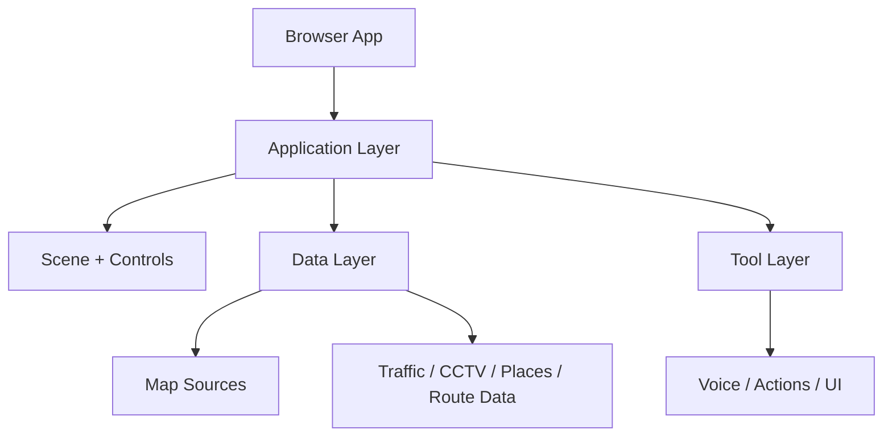
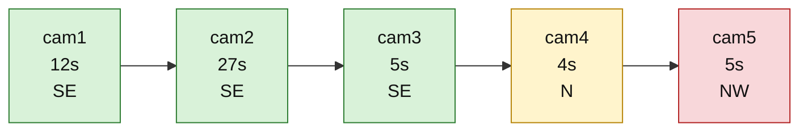

# Project Graphify

This document is the handoff summary for a new agent working in this repository. It explains the project in plain language, highlights the main systems, and records the current investigation area.

## 1. Project overview

This repository is a browser-based geospatial intelligence console named Trinetra.

It combines:
- a 3D globe / map viewer
- live traffic and aircraft data
- CCTV and camera-based detection overlays
- place and route search
- voice control and app orchestration
- local demo datasets and QA scripts

The project is implemented primarily as a Vite + JavaScript app, with browser-facing runtime logic and supporting Python tooling for tasks like ANPR scanning.

## 2. Main folders

- [package.json](package.json): project manifest and scripts
- [docs](docs): product and architecture documentation
- [src](src): application source code
- [server](server): server/provider logic and backend integration
- [public](public): static/demo assets
- [scripts](scripts): build, QA, and validation automation
- [tools](tools): utility scripts and scanning tools
- [config](config): camera/source config JSON files

## 3. Runtime entry points

The app is started through the package scripts from [package.json](package.json):

- npm run dev
- npm run build
- npm run test
- npm run qa:transit
- npm run anpr:scan

The most relevant architecture docs are:
- [docs/APPLICATION.md](docs/APPLICATION.md)
- [docs/CURRENT-STATE.md](docs/CURRENT-STATE.md)
- [docs/CODE-BOUNDARIES.md](docs/CODE-BOUNDARIES.md)

## 4. Core architecture

The app has a layered structure:

The application is organized around:
- scene creation
- control wiring
- data registration
- tool composition
- source/provider configuration

The architecture document explains that the app is built as composable constructor stages instead of being a monolithic startup file.

## 5. Current investigation context

The currently active issue is in the demo route test data at [public/demo/bike-test/detections.json](public/demo/bike-test/detections.json).

The tracked vehicle is:
- place: Tumakuru
- vehicle: black scooter
- plate: 5826
- track ID: tumakuru-scooter-001

### Detection sequence

| Order | Camera | Time (s) | Confidence | Direction |
|---|---|---:|---:|---|
| 1 | cam1 | 12 | 0.96 | southeast |
| 2 | cam2 | 27 | 0.95 | southeast |
| 3 | cam3 | 5 | 0.94 | southeast |
| 4 | cam4 | 4 | 0.93 | north |
| 5 | cam5 | 5 | 0.94 | northwest |

### Route graph

## 6. What the anomaly likely means

This is not a smooth single-path route. The direction history is:

SE -> SE -> SE -> N -> NW

That indicates a likely issue such as:
- tracking mismatch
- camera assignment error
- false detection association
- a real route turn that is not consistent with the sequence timing

The next agent should validate whether the movement is actually realistic based on camera placement and travel geometry before trusting the final path.

## 7. Recommended next-agent checklist

1. Read the route demo JSON and confirm the detection order.
2. Check whether the camera positions can support that turning pattern.
3. Validate if the same vehicle ID is reused wrongly across multiple objects.
4. Check whether the direction labels are derived from road orientation or a noisy classifier.
5. Decide: valid route, bad association, or calibration anomaly.
6. If needed, fix the data source or route-logic handling before moving on.

## 8. Operational status

The repo is currently in a working, inspect-and-validate state, not a completed final fix state. The strongest known issue is the abrupt direction change in the tracked scooter route demo.

This file is intended to keep the project context clear for the next agent without needing to rediscover the same facts from scratch.
