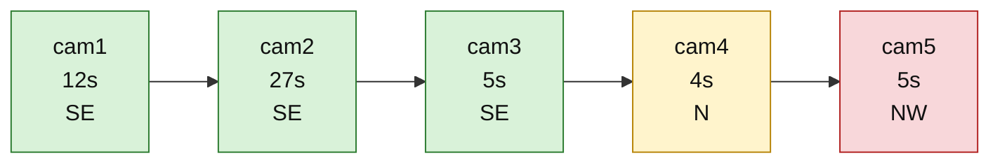

# Bike Detection Route Graph

This file summarizes the tracked scooter detection path for the Tumakuru demo so a new agent can understand the sequence quickly without reading the raw JSON manually.

## Source
- Data file: `public/demo/bike-test/detections.json`
- Place: Tumakuru
- Vehicle: black scooter, plate `5826`, track ID `tumakuru-scooter-001`

## Detection sequence

| Order | Camera | Time (s) | Confidence | Direction |
|---|---|---:|---:|---|
| 1 | cam1 | 12 | 0.96 | southeast |
| 2 | cam2 | 27 | 0.95 | southeast |
| 3 | cam3 | 5 | 0.94 | southeast |
| 4 | cam4 | 4 | 0.93 | north |
| 5 | cam5 | 5 | 0.94 | northwest |

## Graph view

## Interpretation

- The vehicle is strongly consistent in the first three detections: all are heading southeast.
- Then the route switches sharply to north at cam4.
- It continues as northwest at cam5.

This creates a direction reversal that does not look like a smooth single travel path. It is likely one of the following:

1. A real route change or loop in the road network.
2. A false-positive or wrong camera association.
3. A tracking anomaly where the same vehicle ID is reused across different paths.
4. A camera or direction calibration problem.

## Likely anomaly signal

The path is not internally consistent as a single clean route because the direction history is:

`SE -> SE -> SE -> N -> NW`

That pattern suggests the data should be reviewed before trusting it as a final route reconstruction.

## What the next agent should verify

- Check whether the camera network layout supports a route from southeast to north without a large detour.
- Confirm whether cam4 and cam5 belong to the same physical vehicle trace or a different object with the same plate.
- Compare timestamps and camera geometry to detect missed frames or misassignments.
- Review whether the direction labels are derived from road orientation or a directional model that can flip due to detection noise.

## Bottom line

This is a valid tracking sample to investigate, but not a clean end-to-end route confirmation. The strongest issue is the abrupt directional flip near the end of the sequence.
